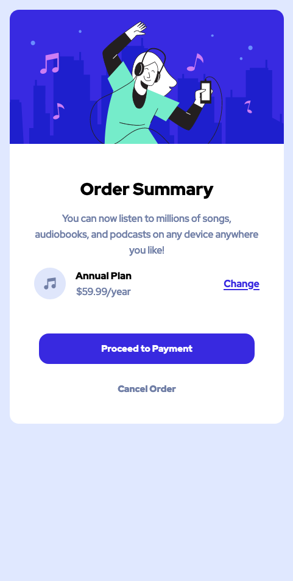
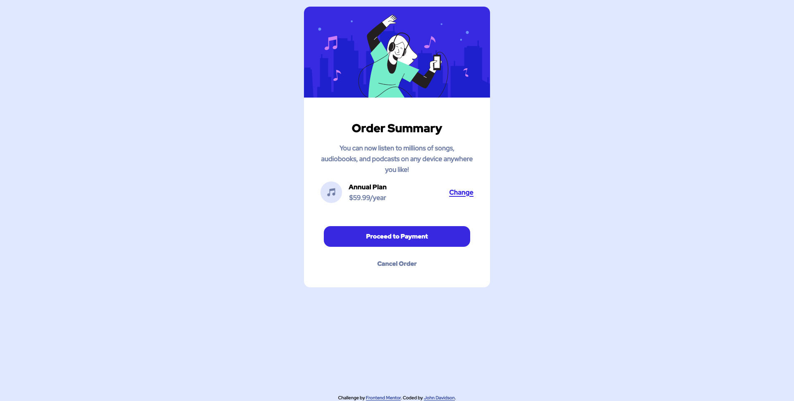

# Frontend Mentor - Order summary card solution

This is a solution to the [Order summary card challenge on Frontend Mentor](https://www.frontendmentor.io/challenges/order-summary-component-QlPmajDUj). Frontend Mentor challenges help you improve your coding skills by building realistic projects.

## Table of contents

- [Overview](#overview)
  - [The challenge](#the-challenge)
  - [Screenshot](#screenshot)
  - [Links](#links)
- [My process](#my-process)
  - [Built with](#built-with)
  - [What I learned](#what-i-learned)
  - [Continued development](#continued-development)
  - [Useful resources](#useful-resources)
- [Author](#author)
- [Acknowledgments](#acknowledgments)

## Overview

A small Frontend Mentor challenge using HTML, CSS, and CSS Flexbox.

### The challenge


### Screenshot





### Links

- Solution URL: [Add solution URL here](https://github.com/John-Davidson-8/fem-order-summary-component-main)
- Live Site URL: [Add live site URL here](https://fem-order-summary-main.netlify.app/)

## My process

### Built with

- Semantic HTML5 markup
- CSS custom properties
- Flexbox
- Mobile-first workflow

### What I learned

What stood out for me in creating this card was working with Flexbox. It's flexibility is amazing. One problem I seemed to always come across was how to place the attribution code which is the footer on the base of the screen. I placed the card within the main element and the footer with attribution in the place below. The following CSS keeps that gap for me, see CSS below. This is possible using Flexbox and the column layout. Flex set to auto is the shorthand for this hack.

```html
<main></main>
<footer></footer>
```

```css
main {
  /* display: flex;
  flex-direction: column;
  flex: 1; */
  flex: auto;
}
```

### Continued development

Getting to grips with CSS Flexbox and understanding the box model with margin and padding is essential for me. The Odin Project has links to great resources in learning Flexbox in particular.

### Useful resources

- (https://developer.mozilla.org/en-US/docs/Web/CSS/CSS_Flexible_Box_Layout/Typical_Use_Cases_of_Flexbox#form_controls) - This helped me for understanding typical use cases for Flexbox.
- (https://www.youtube.com/watch?v=u044iM9xsWU&t=1s) - This is an amazing short video by Kevin Powell on Flexbox. He has many excellent tutorials on CSS.

## Author

- Frontend Mentor - [@John-Davidson-8](https://www.frontendmentor.io/profile/John-Davidson-8)
- Github (https://github.com/John-Davidson-8)

## Acknowledgments

I would like to thank the Odin Project for helping in this project. Also, Alex on the Frontend Mentor Discord group.
